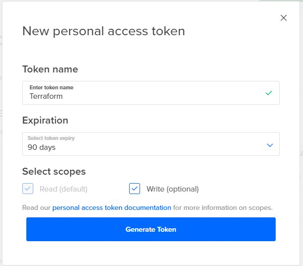
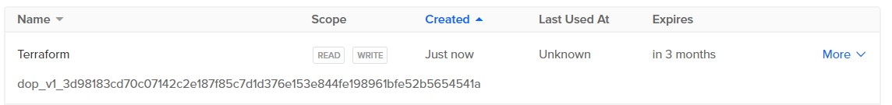

# CDKTF Examples

## Installation

### Terraform

To use the examples in this repo you will require Terraform to be installed. To install Terraform, you can use the instructions
in the following guide.

[https://developer.hashicorp.com/terraform/tutorials/aws-get-started/install-cli](https://developer.hashicorp.com/terraform/tutorials/aws-get-started/install-cli)

### CDKTF

You will also need the Terraform CDKTF and NodeJS, please follow the instructions in the guide below to install these dependencies.

[https://developer.hashicorp.com/terraform/tutorials/cdktf/cdktf-install](https://developer.hashicorp.com/terraform/tutorials/cdktf/cdktf-install)


## Authentication

Terraform requires authentication in order to interact with the DigitalOcean and CloudFlare APIs. The following section shows how to obtain
and set the tokens for each provider.

### Digital Ocean Token

Fetch your token from 

(https://cloud.digitalocean.com/account/api/tokens)[https://cloud.digitalocean.com/account/api/tokens]



If you complete the details and then press the `Generate` button you will be taken back to the other screen and the token will
be shown.



Copy this token and set it as an environment variable, Terraform will automatically read this variable and automatically
pass it with any API request. Using an environment ensures that the API key is not hardcoded into the config and accidentally
leaks into the public domain. Leaking your API key will allow third parties to create infrastructure in your DigitalOcean
account (The token in the image above was revoked just after the screenshot was taken).

```shell
export DIGITALOCEAN_TOKEN="xxxxxxxxxxxxxxxxxxxxxxxxxxxxxxxxxxxxxxxxx"
```

### Cloudflare Token

You can get a token from the following URL:

https://dash.cloudflare.com/profile/api-tokens

If you click on 

```shell
export CLOUDFLARE_ACCOUNT_ID="xxxxxxxxxxxxxxxxxxxxxxxxxxxxxxxxxxxxxxx"
export CLOUDFLARE_API_TOKEN="xxxxxxxxxxxxxxxxxxxxxxxxxxxxxxxxxxxxxxx"
```

**NOTE:** Cloudflare is optional and can be disabled by setting the environment variable `TF_VAR_cloudflare_enabled=false`

## Examples

### Go

#### ./go/basic

Example using Cloudflare and DigitalOcean to deploy a DigitalOcean App and expose a Cloudflare domain for public access.

#### ./go/modules/example

Example to create a DigitalOcean App using a CDKTF Typescript module

### HCL

#### ./hcl/basic

Example using Cloudflare and DigitalOcean to deploy a DigitalOcean App and expose a Cloudflare domain for public access.

### Python

#### ./python/basic

Example using Cloudflare and DigitalOcean to deploy a DigitalOcean App and expose a Cloudflare domain for public access.

#### ./python/modules/do_app

Example that defines a DigitalOcean App as a consumable module

#### ./python/modules/example

Example to create a DigitalOcean App using a CDKTF Typescript module

### Typescript

#### ./typescript/basic

Example using Cloudflare and DigitalOcean to deploy a DigitalOcean App and expose a Cloudflare domain for public access.

#### ./typescript/modules/do_app

Example that defines a DigitalOcean App as a consumable module

#### ./typescript/modules/example

Example to create a DigitalOcean App using a CDKTF Python module
